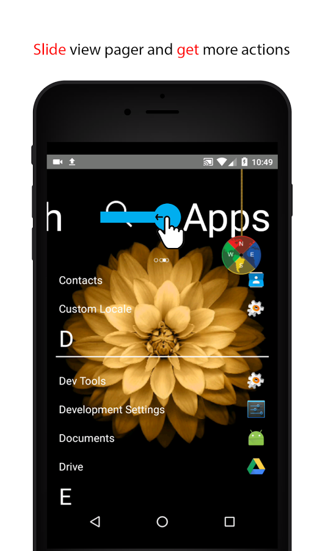

# Zo Launcher - Android Custom Launcher 

Zo Launcher is one of the top handwriting launcher in category on Google Play. You can write on screen and find out your applications. Beside that, this is a simple, beautiful and adorable launcher. 
wallabag is available on the Google Play Store.

  
 

## Features
What Can Solo Launcher Do Better Than Competitors?
- One of the first launchers that uses Material Design.
- Handwriting for searching.
- Most featured launcher on Google Play.
- Compass in your home launcher.
- Easy to uninstall and get information applications.
- No App Drawer: All of applications are push on one page.

There are a lot more features that we are working on currently and we are looking forward to bringing them to you, including complete support for next Zo Launcher generation and a redesign of the app to bring it even more in alignment with Google's Material Design guidelines.

## Screenshots

## Permissions

On Android versions prior to Android 6.0, Zo Launcher requires the following permissions:
- Full Network Access.
- View Network Connections.
- Location Access.
- Read and write access to external storage.

The "Location Access" permission is only used if Zo Launcher gets location for displaying on Screen.

## Contributing
Zo Launcher is a purchased app. It doesn't have Ads or appear Ads.

## License
Some of the used libraries are released under different licenses.
